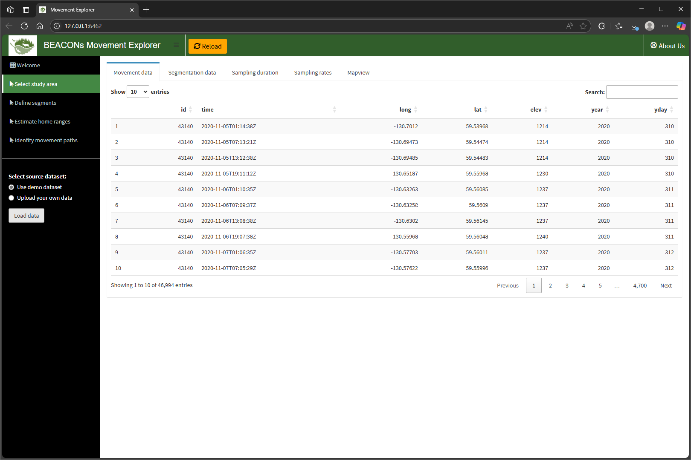
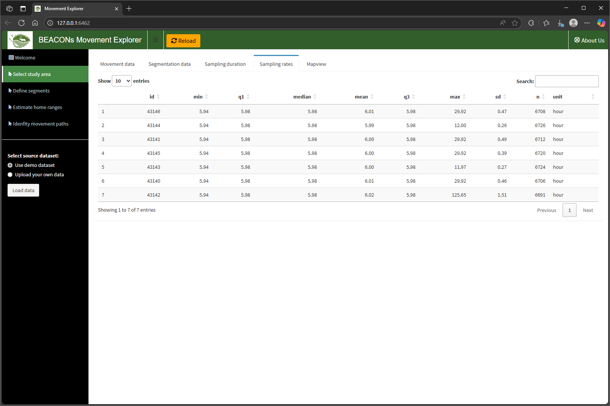
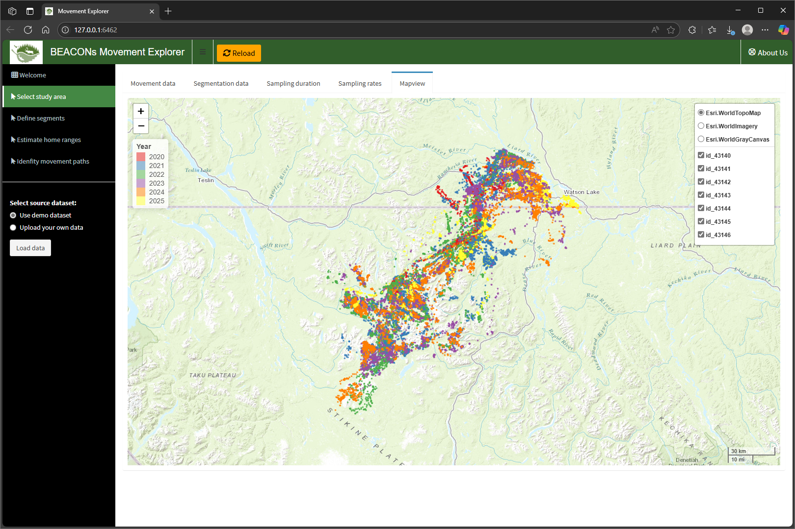
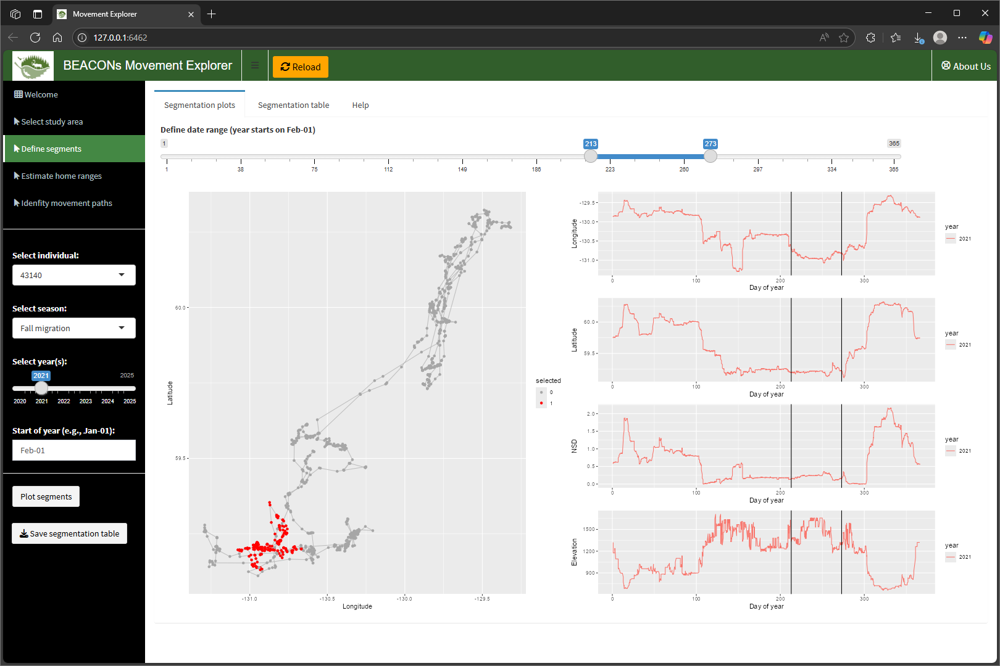
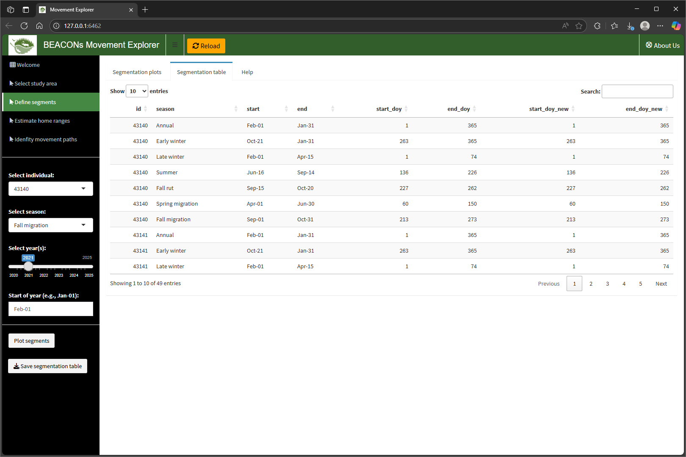
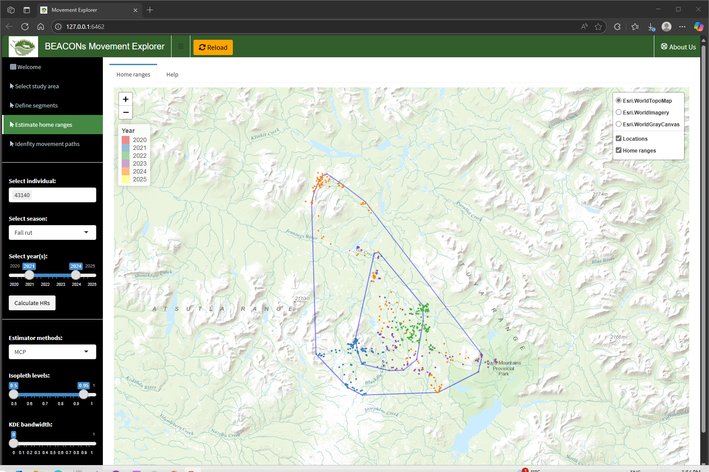
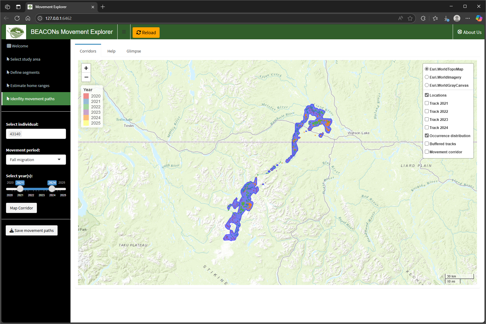

## User guide

Understanding how animals move and migrate is important for conservation and for assessing the effects of human activities and climate change. The Movement Explorer app is a tool designed to visualize and analyze animal movement data, helping us uncover some of these patterns. The app is divided into 5 sections.

### 1. Welcome

The "Welcome" section includes an **Overview** of the app, a **User guide** (this section), and a description of the **Datasets** required to use the app. It is highly recommended that a user first read these sections, especially the **Datasets** section prior to using the app.

### 2. Select data

The "Select data" section is where you upload the data that you would like to view and analyse. As long as your data is formatted correctly as described in the **Datasets** section, uploading it into the app is straightforward. To use you own dataset, select the "Upload your own data" radiobutton. If, on the other hand, you just want to test the app out without your own data, you can just select "Use demo dataset" radiobutton.

After the files have been selected, just click on the **Load data** button. Once the data are loaded they will be displayed in the five tabs on the right:

**Movement data**. Displays the movement data that was uploaded.

 

**Segmentation data**. Displays the segmentation data that was uploaded.

 

**Sampling duration**. Plots a graph showing, for each individual animal, the length of time that its location was recorded.

 

**Sampling rates**. Displays descriptive statistics of sampling rates for each individual animal such as the average length of time between relocation.

 

**Mapview**. Interactive map displaying GPS relocations for all animals in the study area.

 

### 3. Define segments

The "Define segments" section is where you view and modify the start and end dates for each seasonal or migration period for each individual animal. You first select an individual and a range of years and then click on the **Plot segments** button. The app provides plots that show the animal's movement speed and direction over time. These plots help identify the start and end points of migration periods. You can use a slider to adjust these points. Initially, they are set to the values that were uploaded in the segmentation data provided by the user. There are two main output tabs on the right:

- **Segmentation plots**: The larger plot on the left shows the distribution of relocations for that individual and range of years. The red points highlight those that are within the fall migration period. The three plots on the right provide information of the speed and direction of movement across time, from Jan 1 to Dec 31, measure as day of year from 1 to 365. The top 2 graphs show the relationship between longitude and latitude and day of year. Likewise, the bottom graph plots the net squared displacement (or NSD) over time. Higher NSD values indicate larger distances travelled over 6 hour periods. Together, these plots can help identify start and end times of migration periods. We can adjust the start and end times using the slider and this will change the vertical bars in the plots as well as the points highlighted in red.

 

- **Segmentation table**: This is an extended version of the segmentation data that was uploaded. It is first duplicated for each individual animal and then start and end dates are converted into day-of-year format, ranging from 1-365. The last 2 columns are initially filled with 0s but will be populated with values derived from moving the two sliders.

 

Once you are satisfied with the modifications you've made to the start and end dates, you can save the results to a new segmentation table by clicking the **Save segmentation table** button.

### 4. Home ranges

Seasonal and annual home ranges can be estimated for individual or groups of individuals using one of more years of data using the interface elements (**Select individual**, **Select season**, **Select year(s)**) in the sidebar. Three **Estimator methods** are currently available: minimum convex polygons (MCP), kernel density estimates (KDE), and autocorrelated KDEs. **Isopleth levels** are set to 0.5 and 0.95 but can be modified using the slider. The **KDE bandwidth** currently cannot be modified. To estimate and visualize the home ranges just click on the **Calculate HRs** button. The map on the right will display two home range boundaries based on the user-selected method and isopleth levels. The underlying points and trajectories can also be viewed. Additionally, disturbances and conservation areas are displayed. Not all layers are turned on, but these can be turned on and off by selecting them in the legend.

 

You can click on the **Save home ranges** button at any time to download the estimated home ranges. After you click the button, you can select a folder and filename of your choice.

### 5. Movement paths

Movement paths (corridors) can be estimated for individual or groups of individuals using one of more years of data using the interface elements (**Select individual**, **Movement period**, **Select year(s)**) in the sidebar. Currently, only "Spring" and "Fall" migration periods are permitted. By clicking on the **Map corridor** button, the app calculates and displays the likely paths that animals take during their spring and fall migrations. These paths are the estimated movement paths (corridors) used by the selected individual(s) for the selected time period. The computation may take a bit of time depending on the amount of input data or caribou relocations that we have available. Once the computation has completed, several map layers will be shown in the map and associated legend, including the estimated movement paths (corridors) as well as the underlying GPS data and trajectories.

 

You can click on the **Save movement paths** button at any time to download the estimated home ranges. After you click the button, you can select a folder and filename of your choice.